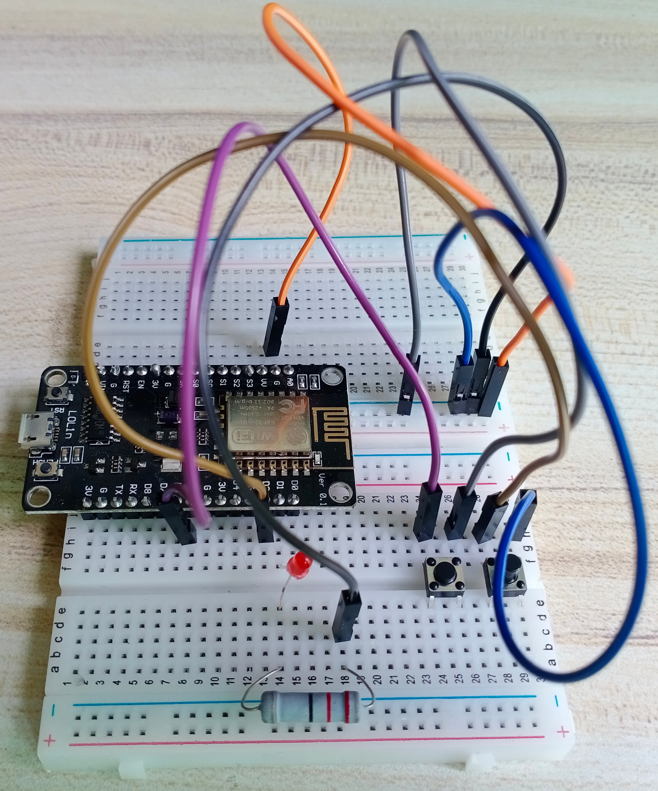
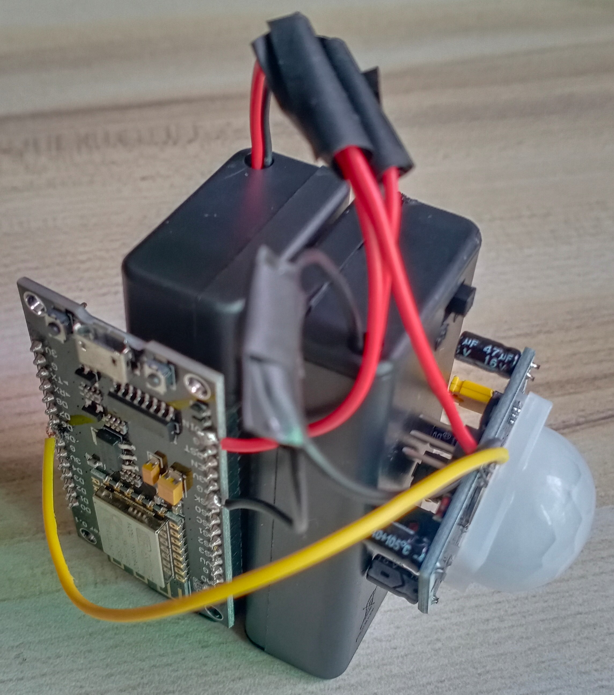

# ALIS

ALIS，全称Anti-Leadership-Inspection-System，即反领导巡查系统。

原理为人体红外探测器探测人体，然后发送信号到指定的设备进行提醒。

---

AP端数据收发热点：

* SSID：YuXiang ALIS
* 密码：YuXiang187.@TdF.*

IP地址：

* PC：192.168.1.100
* AP：192.168.1.1
* STA1：192.168.1.10
* STA2：192.168.1.11

---

AP控制端预览（未焊接）：



STA探测端预览（已焊接）：



## AP控制端

ESP8266 AP端代码：

```c++
#include <ESP8266WiFi.h>
#include <WiFiUdp.h>
#include <Ticker.h>
// WiFi
const char *ssid = "YuXiang ALIS";
const char *password = "YuXiang187.@TdF.*";
// UDP
unsigned int readPort = 20001;
unsigned int sendPort = 20002;
char readdata[512];
WiFiUDP Udp;
// IO
int stateLed = D4;
int switchBtn = D2;
int sendBtn = D5;
// Other
Ticker t;
int switchBtnState = HIGH;
int sendBtnState = HIGH;
int id = 0;
bool isOpen = false;

void init_IO() {
  pinMode(stateLed, OUTPUT);
  digitalWrite(stateLed, HIGH);
  pinMode(switchBtn, INPUT_PULLUP);
  pinMode(sendBtn, INPUT_PULLUP);
}

void init_AP() {
  WiFi.mode(WIFI_AP);
  WiFi.softAP(ssid, password);
  // IP: 192.168.1.1
  IPAddress softLocal(192, 168, 1, 1);
  IPAddress softGateway(192, 168, 1, 1);
  IPAddress softSubnet(255, 255, 255, 0);
  // 配置自定义IP
  WiFi.softAPConfig(softLocal, softGateway, softSubnet);
  Serial.println(WiFi.softAPIP());
}

// 接收数据，返回String
String Read_Udp() {
  String data = "";
  int packetSize = Udp.parsePacket();
  if (packetSize) {
    memset(readdata, 0x00, sizeof(readdata));
    Udp.read(readdata, 511);
    Udp.flush();
    for (int i = 0; i < packetSize; i++) {
      data += readdata[i];
    }
  }
  return data;
}

// 处理接收到的数据
void Udp_Handler(String data) {
  if (data != "") {
    if (data == "on10") {
      if (isOpen == true) {
        id = 10;
        digitalWrite(stateLed, LOW);
      }
    } else if (data == "on11") {
      if (isOpen == true) {
        id = 11;
        digitalWrite(stateLed, LOW);
      }
    } else if (data == "off") {
      digitalWrite(stateLed, HIGH);
    } else if (data == "pc") {
      for (int i = 0; i <= 5; i++) {
        digitalWrite(stateLed, !digitalRead(stateLed));
        delay(1000);
      }
    }
  }
}

// 发送数据，data为发送内容
void sendData(String data) {
  IPAddress pcClient(192, 168, 1, 100);
  Udp.beginPacket(pcClient, sendPort);
  Udp.print(data);
  Udp.endPacket();
}

void sendWarning() {
  if (id == 10) {
    sendData("warn10");
  } else if (id == 11) {
    sendData("warn11");
  } else {
    sendData("warn");
  }
}

void setup() {
  Serial.begin(115200);
  init_IO();
  init_AP();
  Udp.begin(readPort);
}

void loop() {
  int sendBtnVal = digitalRead(sendBtn);
  if (sendBtnVal != sendBtnState) {
    sendBtnState = sendBtnVal;
    if (sendBtnVal == LOW) {
      t.attach_ms(1500, sendWarning);
    } else {
      t.detach();
    }
  }
  int switchBtnVal = digitalRead(switchBtn);
  if (switchBtnVal != switchBtnState) {
    switchBtnState = switchBtnVal;
    if (switchBtnVal == LOW) {
      isOpen = !isOpen;
      if (isOpen == true) {
        digitalWrite(stateLed, LOW);
        delay(1500);
        digitalWrite(stateLed, HIGH);
      } else {
        for (int i = 0; i < 5; i++) {
          digitalWrite(stateLed, LOW);
          delay(200);
          digitalWrite(stateLed, HIGH);
          delay(200);
        }
      }
    }
  }
  if (WiFi.softAPgetStationNum() != 0) {
    Udp_Handler(Read_Udp());
  }
}
```

## STA探测端

ESP8266 STA端代码（更改192.168.1.10和on10以便连接其他设备）：

```c++
#include <ESP8266WiFi.h>
#include <WiFiUdp.h>
// WiFi
const char *ssid = "YuXiang ALIS";
const char *password = "YuXiang187.@TdF.*";
// UDP
unsigned int readPort = 20002;
unsigned int sendPort = 20001;
char readdata[512];
IPAddress ap_ip(192, 168, 1, 1);
WiFiUDP Udp;
// IO
int stateLed = D4;
int sensor = D5;

void init_IO()
{
  pinMode(stateLed, OUTPUT);
  digitalWrite(stateLed, 1);
  pinMode(sensor, INPUT);
}

void init_STA()
{
  IPAddress local_ip(192, 168, 1, 10);
  IPAddress arg1(192, 168, 1, 1);
  IPAddress arg2(255, 255, 255, 0);
  IPAddress arg3(192, 168, 1, 1);
  IPAddress dns2(192, 168, 1, 1);
  WiFi.disconnect();
  WiFi.config(local_ip, arg1, arg2, arg3, dns2);
  WiFi.mode(WIFI_STA);
  WiFi.begin(ssid, password);
  while (WiFi.status() != WL_CONNECTED)
  {
    delay(500);
    digitalWrite(stateLed, !digitalRead(stateLed));
    Serial.print(".");
  }
  digitalWrite(stateLed, 1);
  Serial.print(WiFi.localIP());
}

// 接收数据，返回String
String Read_Udp()
{
  String data = "";
  int packetSize = Udp.parsePacket();
  if (packetSize)
  {
    memset(readdata, 0x00, sizeof(readdata));
    Udp.read(readdata, 511);
    Udp.flush();
    for (int i = 0; i < packetSize; i++)
    {
      data += readdata[i];
    }
    Serial.println(data);
  }
  return data;
}

// 发送数据，data为发送内容
void sendData(String data)
{
  Udp.beginPacket(ap_ip, sendPort);
  Udp.print(data);
  Udp.endPacket();
}

void setup()
{
  Serial.begin(115200);
  Serial.println("");
  init_IO();
  init_STA();
  Udp.begin(readPort);
}

void loop()
{
  int sensorVal = digitalRead(sensor);
  if (sensorVal == HIGH)
  {
    sendData("on10");
  }
  else
  {
    sendData("off");
  }
}
```

## PC警报端

请前往Release下载`ALIS.exe`后，双击程序运行。
